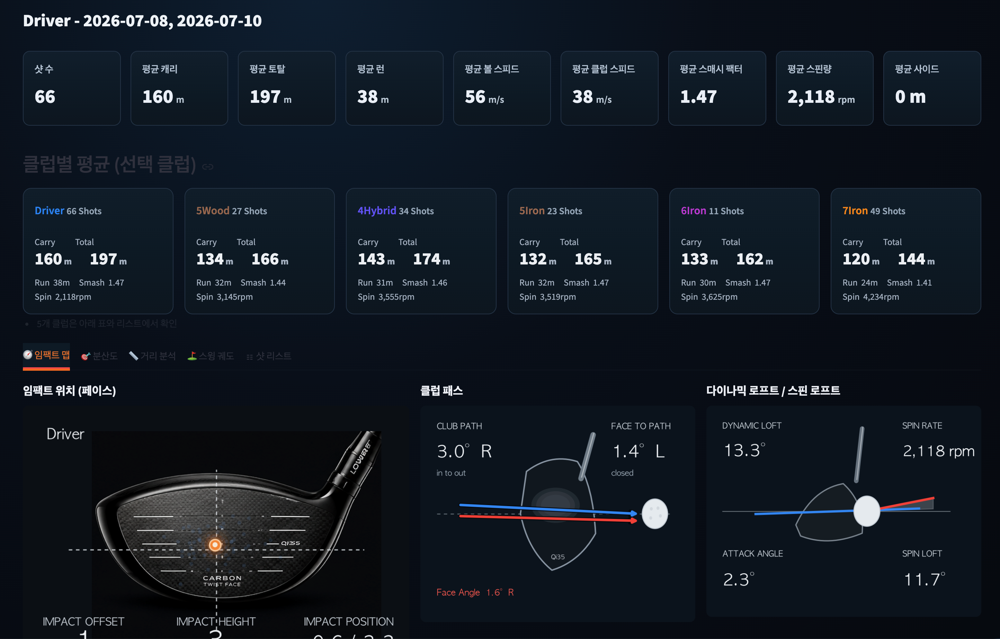

# 🏌️ TrackMan Dashboard


TrackMan `getactivityreport` JSON 또는 Shot CSV를 업로드하여
클럽별 성능을 분석하고, 날짜별/기간별 변화까지 확인할 수 있는
Streamlit 기반 골프 연습 분석 대시보드입니다.

---

# 주요 기능

## 📂 데이터 업로드

- TrackMan `getactivityreport` JSON 업로드
- Shot CSV 업로드 지원
- 여러 개의 JSON 동시 업로드
- 자동 데이터 병합

---

## 📅 날짜 및 기간 분석

- 특정 날짜 연습 데이터 분석
- 여러 날짜 평균 비교
- 월간 평균과 특정 날짜 비교
- 연간 평균과 특정 날짜 비교

---

## 🏌️ 클럽별 분석

지원 클럽

- Driver
- Wood
- Hybrid
- Long Iron
- Mid Iron
- Short Iron
- Wedge

클럽 선택 시

- 평균값 자동 계산
- 샷 개수 표시
- 최고/최저값 확인

---

## 📊 주요 성능 지표

다음 항목을 카드 형태로 제공합니다.

- Carry
- Total
- Ball Speed
- Club Speed
- Smash Factor
- Spin Rate
- Launch Angle
- Attack Angle
- Club Path
- Face Angle
- Face To Path
- Dynamic Loft
- Spin Loft
- Max Height
- Landing Angle
- Offline
- Side
- Apex

---

## 📈 기간 비교

선택한 날짜와

- 월간 평균
- 연간 평균

을 동시에 비교하여

- 증가
- 감소
- 변화량

을 직관적으로 확인할 수 있습니다.

---

## 🎯 임팩트 분석

클럽별 평균 임팩트 위치

- Heel / Toe
- High / Low

시각화

또한

각 샷별 임팩트 위치도 확인할 수 있습니다.

---

## 🏌️ 스윙 분석

시각화 제공

- Club Path
- Face Angle
- Face To Path
- Dynamic Loft

---

## 📋 샷 상세 분석

각 샷별

- 모든 TrackMan 데이터
- 볼 데이터
- 클럽 데이터

를 표 형태로 제공합니다.

---

## 📊 인터랙티브 차트

- Plotly 기반 차트
- 확대/축소 가능
- Hover 정보 제공

---

## 설치

```bash
python3 -m venv .venv
source .venv/bin/activate

pip install -r requirements.txt
```

---

## 실행

```bash
python -m streamlit run streamlit_app.py
```

---

## 데이터 준비

### 방법 1 : TrackMan JSON

1. TrackMan Web 접속
2. Chrome DevTools 실행
3. Network 선택
4. `getactivityreport` 요청 선택
5. Response 저장
6. JSON 업로드

---

### 방법 2 : Shot CSV

이미 변환된 Shot CSV를 업로드하여
동일하게 분석할 수 있습니다.

---

## 프로젝트 구조

```
trackman_dashboard_project/
│
├── streamlit_app.py        # Streamlit UI
├── trackman_core.py        # 데이터 처리
├── trackman_cli.py         # JSON → CSV 변환
├── requirements.txt
├── README.md
│
├── assets/
│   ├── impact.png
│   ├── club_path.png
│   └── ...
│
└── data/
```

---

## 사용 기술

- Python
- Streamlit
- Pandas
- Plotly
- NumPy
- Pillow

---

## 향후 개발 계획

- AI 스윙 분석
- 클럽별 추세 분석
- 목표 거리 관리
- 평균 대비 편차 분석
- 연습 성과 리포트 자동 생성(PDF)
- 사용자별 데이터 관리
- 클라우드 데이터 저장

---

## License

Personal Project

TrackMan®는 TrackMan A/S의 등록 상표입니다.

본 프로젝트는 개인 연습 데이터 분석을 위한 비공식 프로젝트입니다.